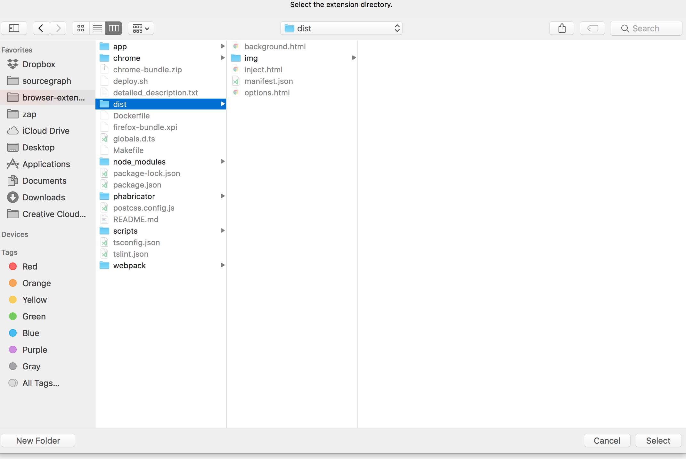

# Sourcegraph browser extensions for Google Chrome and Firefox

## Overview

The Sourcegraph browser extension adds tooltips to code on GitHub, Phabricator, and Bitbucket.
The tooltips include features like:
  - symbol type information & documentation
  - go to definition & find references (currently for Go, Java, TypeScript, JavaScript, Python)
  - find references
  - improved search functionality

It works as follows:
  - when visiting e.g. https://github.com/..., the extension injects a content script (inject.bundle.js)
  - there is a background script running to access certain chrome APIs, like storage (background.bundle.js)
  - a "code view" contains rendered (syntax highlighted) code (in an HTML table); the extension adds event listeners to the code view which control the tooltip
  - when the user mouses over a code table cell, the extension modifies the DOM node:
    - text nodes are wrapped in <span> (so hover/click events have appropriate specificity)
    - element nodes may be recursively split into multiple element nodes (e.g. a <span>&Router{namedRoutes:<span> contains multiple code tokens, and event targets need more granular ranges)
    - ^^ we assume syntax highlighting takes care of the base case of wrapping a discrete language symbol
    - tooltip data is fetched from the Sourcegraph API
  - when an event occurs, we modify a central state store about what kind of tooltip to display
  - code subscribes to the central store updates, and creates/adds/removes/hides an absolutely positioned element (the tooltip)

## Project Layout

- `app/`
  - application code, e.g. injected onto GitHub (as a content script)
- `chrome/`
  - entrypoint for Chrome extension. Includes bundled assets, background scripts, options)
- `phabricator/`
  - entrypoint for Phabricator extension. The Phabricator extension is injected by Phabricator (not Chrome)
- `scripts/`
  - development scripts
- `test/`
  - test code
- `webpack`
  - build configs

## Requirements

- `node`
- `yarn`
- `make`

## Development (Chrome)

```bash
$ npm install
$ npm run dev
```

This will create a `dist` folder in the workspace. From there, in Chrome:

* Browse to [chrome://extensions](chrome://extensions).
* If you already have the Sourcegraph extension installed, disable it by unchecking the "Enabled" box.
* Click on [Load unpacked extensions](https://developer.chrome.com/extensions/getstarted#unpacked), and select the `dist` folder.
* Browse to any public repository on GitHub to confirm it is working.
* After making changes it is necessary to refresh the extension. This is done by going to [chrome://extensions](chrome://extensions) and clicking "Reload".



## Development (Firefox)

* `make bundle`
* Go to `about:debugging`
* Select "Enable add-on debugging"
* Click "Load Temporary Add-on" and select "firefox-bundle.xpi"
* [More information](https://developer.mozilla.org/en-US/docs/Tools/about:debugging#Add-ons)

## Testing

Coming soon...

## Deploy (Chrome)

- Sign in via Google with your Sourcegraph email address.
- Naviate to https://chrome.google.com/webstore/developer/dashboard?pli=1
- Click "edit" in the row associated with Sourcegraph for GitHub
- Click "Upload Updated Package" in the top section (inside Upload).
- Ensure that you have bumped and commited the version in both the `manifest.json` and the `manifest.dev.json` files.
- Click choose file and select the `chrome-bundle.zip` file.
- Run `make bundle` to generate the new production build.
- Add release notes and submit the build. It will be availble for the submitter instantly, but users will see it in a couple of hours. If this is a big fix for a bug then it is worth telling users they can go to `chrome://extensions` and clicking "Update extensions now" (This option is only available if "Developer mode" is enabled).
- Click "Publish Changes"

### Automated

To deploy the chrome extension with your Google Apps credentials, you must have `CHROME_WEBSTORE_CLIENT_SECRET` on your environment and
be part of the "sg chrome ext devs" Google group. (You must also pay Google a one-time fee of $5...)

```bash
$ make deploy
```

## Deploy (Firefox)

- Sign into Firefox under a Sourcegraph developer account
- Go to https://addons.mozilla.org/en-US/developers/addon/sourcegraph-addon-for-github/versions/submit/
- Ensure you have completed the steps above for release a production version. The three most important steps are: 1) Ensure it runs and there are no errors 2) Bump the version. 3) The `dist` build reflects the current changes you've made.
- Click "Select a file..." and click the `firefox-bundle.xpi` that was generated from `make bundle`.
- Following the upload, create a zip of the entire browser-extension reposiotry.
- Upload all of the source code to the Firefox store before clicking continue.
- Append to the version notes if there is something significant. Otherwise use the previous version notes. You can find previous version notes by going to https://addons.mozilla.org/en-US/developers/addon/sourcegraph-addon-for-github/versions and clicking the previous submission.
- ALWAYS INCLUDE NOTES FOR REVIEWERS: (Copy paste what is below, if a significant change happened include it and update the README.)
Running from source:
1) make bundle
3) Go to about:debugging
4) Select "Enable add-on debugging"
5) Load Temporary Add-on
6) Click "Load Temporary Add-on" and select "firefox-bundle.xpi"

NOTE: This extension includes an opt-in for event tracking on GitHub.com for the purposes of personalization.

How to use the extension:
The Sourcegraph developer extension works on GitHub.com. Below you will find a list of Sourcegraph's features with relevant URLs as well as screenshots and videos to help verify the extension.

Relevant URLs:
Open on Sourcegraph URL: https://github.com/gorilla/mux
Code browsing URL: https://github.com/gorilla/mux/blob/master/mux.go

Main features of Sourcegraph:
1) Open in Sourcegraph - This feature takes the user from the repository homepage to viewing the repository on Sourcegraph.com https://goo.gl/jepnDz
2) Code intelligence when hovering over code tokens - This provides developers with IDE like code browsing tools on GitHub - https://goo.gl/G1cMMM
3) Action items for hover tooltip - Users can now see references, the definition, and also search based on the currently selected token. -
https://goo.gl/CHFnjr
4) File tree navigation when viewing a GitHub repository - https://goo.gl/7NafYf
- Click Save Changes
- You're done.
